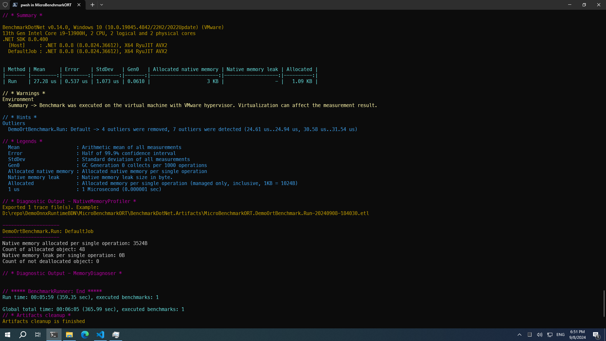
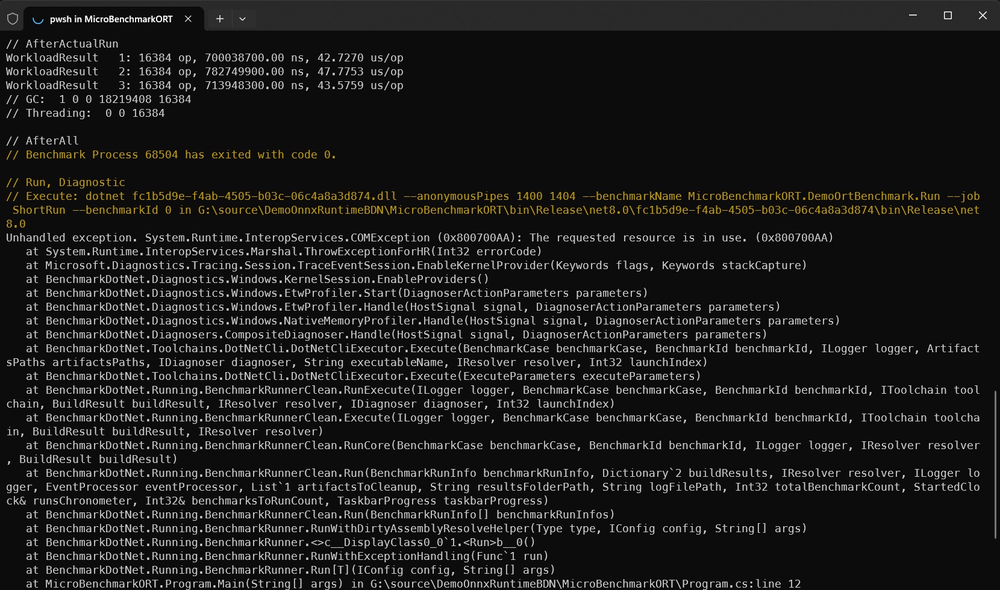

# Demo Onnx Runtime BenchmarkDotNet Memory Usage

## MicroBenchmarkORT

This is a demo project to show how to use [BenchmarkDotNet](https://benchmarkdotnet.org) to investigate memory usage on Windows [C# ONNX Runtime](https://github.com/microsoft/onnxruntime/issues/2763) to run a pre-trained model inference.



To Run the benchmark, on the *MicroBenchmarkORT* project folder, run the following command:

```sh
dotnet run -c Release -- *
```

**Note**: Due to the current Windows 11 23H2 Kernel issue, if you run the *MicroBenchmarkORT* project on Windows 11 23H2 machine, you need to [**disable built-in Windows Defender**](https://github.com/microsoft/perfview/issues/1726#issuecomment-1276697339), or you will get a COM exception and crashed during collecting memory usage result:


